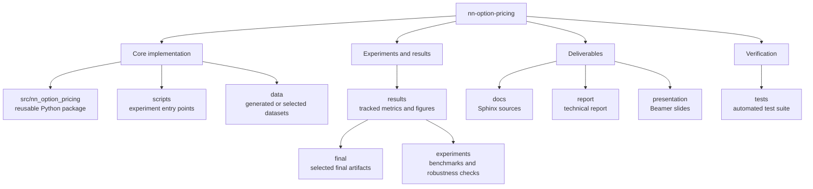

# Neural Network Option Pricing

Project for the **Machine Learning for Finance** course.

This repository studies whether a feed-forward neural network can approximate
the Black-Scholes pricing function for European call options. The project is a
controlled supervised-learning experiment: option data are generated
synthetically under the Black-Scholes framework, the analytical formula provides
the ground truth, and additional benchmarks are used to interpret the neural
network as a pricing surrogate.

## Research Question

Can a feed-forward neural network accurately approximate the Black-Scholes
European call pricing function, and can it act as a fast pricing surrogate after
training?

The project is not a trading system and does not try to predict real market
option prices. It focuses on a known mathematical pricing map, so approximation
error can be measured directly.

## Project Overview

The implemented workflow includes:

- synthetic Black-Scholes dataset generation;
- analytical Black-Scholes pricing;
- Monte Carlo pricing as a numerical benchmark;
- feed-forward neural-network training in PyTorch;
- feature-engineering and activation-function experiments;
- runtime comparison between analytical pricing, neural inference, and Monte Carlo;
- Support Vector Regression as a classical ML baseline;
- controlled noisy-target robustness experiments;
- automated tests, Sphinx documentation, LaTeX report, and Beamer slides.

## Key Result

The selected final neural-network configuration is:

```text
feature set: with_moneyness
activation: silu
```

On the held-out test set, the final model obtains:

| Metric | Value |
|---|---:|
| MAE | 0.04290 |
| RMSE | 0.06208 |
| R² | 0.999993 |
| MAPE, prices > 1 | 0.4803% |

The result supports the conclusion that, within the sampled Black-Scholes
parameter domain, the neural network approximates the analytical pricing map
with high accuracy. The analytical Black-Scholes formula remains exact and
fastest when available; the neural network is studied as a reusable surrogate
model after training.

Final metrics, figures, and configuration snapshots are tracked in
[`results/final/`](results/final/).

## Project Deliverables

The repository includes three main deliverables. The Sphinx site provides a
navigable view of the Python package and experiment workflow. The report
contains the full technical discussion, including mathematical background,
methodology, implementation details, results, and appendices. The presentation
contains the Beamer slides prepared for the oral discussion of the project.

- [Online Sphinx documentation](https://matteogiorgi.github.io/nn-option-pricing)
- [Technical report](report/)
- [Presentation slides](presentation/)

## Repository Structure



Large reproducible artifacts are written to `data/` and `outputs/`. Generated
outputs are ignored by Git unless they are selected final results or compact
experiment summaries used by the report.

## Quick Start

Create a virtual environment and install the package:

```bash
python -m venv .venv
source .venv/bin/activate
pip install -r requirements.txt
pip install -e . --no-build-isolation
```

Run the default experiment:

```bash
python scripts/run_experiment.py
```

Run a fast smoke test:

```bash
python scripts/run_experiment.py \
  --n-samples 10000 \
  --max-epochs 40 \
  --batch-size 1024 \
  --mc-n-paths 5000 \
  --mc-evaluation-samples 128
```

The final reported configuration can be reproduced with:

```bash
python scripts/run_experiment.py \
  --n-samples 100000 \
  --max-epochs 200 \
  --batch-size 1024 \
  --mc-n-paths 50000 \
  --mc-evaluation-samples 512 \
  --feature-set with_moneyness \
  --activation silu \
  --seed 42 \
  --data-dir data/final_improved \
  --output-dir outputs/final_improved
```

## Experiments

Additional experiments are documented in their result directories:

- [`results/experiments/moneyness_feature/`](results/experiments/moneyness_feature/)
- [`results/experiments/activation_functions/`](results/experiments/activation_functions/)
- [`results/experiments/combined_feature_activation/`](results/experiments/combined_feature_activation/)
- [`results/experiments/runtime_benchmark/`](results/experiments/runtime_benchmark/)
- [`results/experiments/svr_benchmark/`](results/experiments/svr_benchmark/)
- [`results/experiments/noisy_targets/`](results/experiments/noisy_targets/)
- [`results/experiments/noisy_svr_benchmark/`](results/experiments/noisy_svr_benchmark/)

Each directory contains the command used for the experiment and the tracked JSON
summary of the results.

## Documentation and Build Commands

The Sphinx documentation is published through GitHub Pages:

```text
https://matteogiorgi.github.io/nn-option-pricing
```

Build it locally with:

```bash
pip install -r requirements-docs.txt
sphinx-build -b html docs/source docs/build/html
```

Build the technical report:

```bash
cd report
latexmk -xelatex main.tex
```

Build the Beamer presentation:

```bash
cd presentation
latexmk -xelatex main.tex
```

Both LaTeX documents use XeLaTeX.

## Testing

Run the automated test suite:

```bash
pytest
```

The tests cover analytical Black-Scholes pricing, synthetic dataset generation,
Monte Carlo pricing, model construction, target-noise generation, SVR
benchmarking, and end-to-end smoke tests.

## Future Work

Natural extensions include:

- Greeks estimation through automatic differentiation;
- more detailed regime-based error analysis;
- stochastic-volatility models;
- path-dependent or American options;
- real exchange-traded option data.

Using real market data would change the research question from Black-Scholes
function approximation to market-price modeling.
