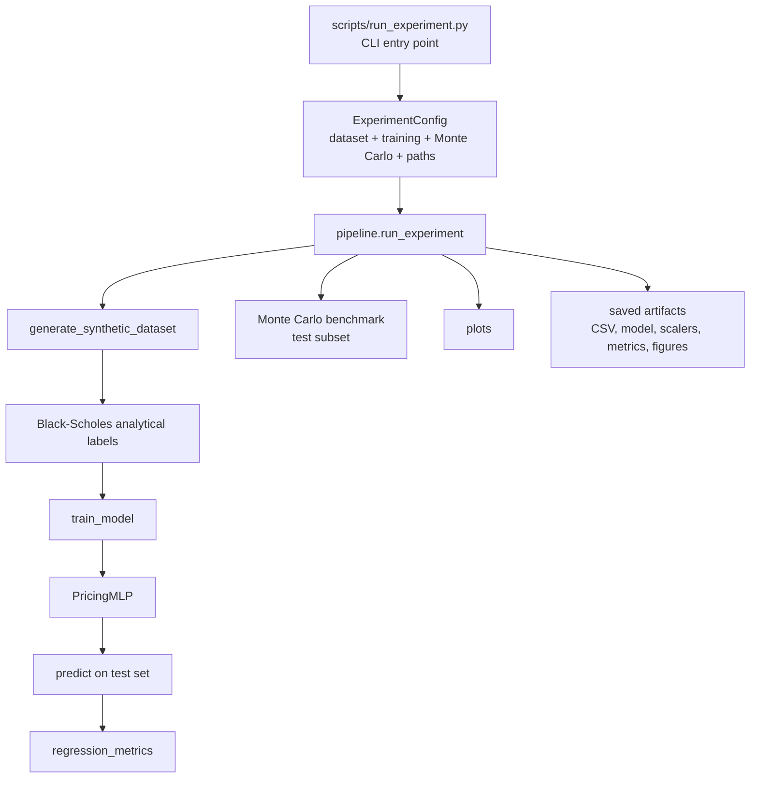
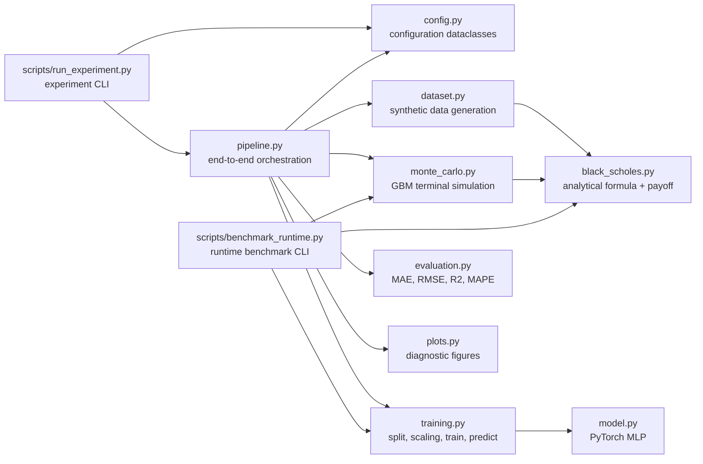
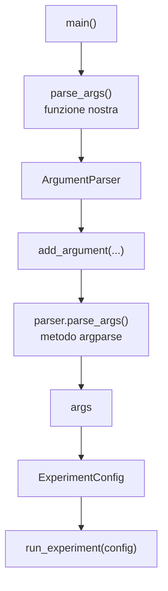
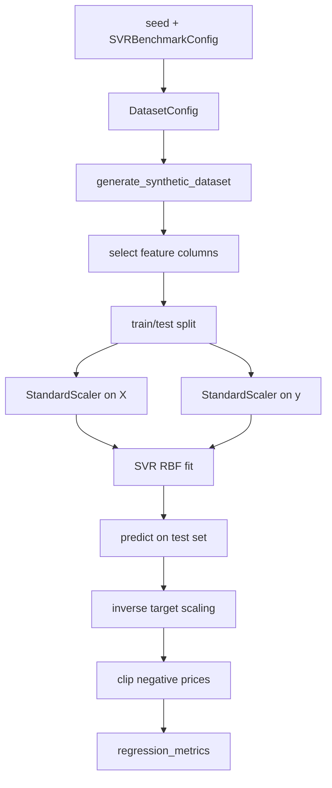

# Appunti di studio sul codice

Questi appunti servono per capire e spiegare il progetto **Neural Network Option Pricing** al gruppo. Sono scritti in italiano e possono essere usati come quaderno condiviso: si possono aggiungere domande, dubbi e richieste di approfondimento direttamente nei punti interessati.

Formato consigliato per le annotazioni:

```md
> DOMANDA:
> ...

> DA APPROFONDIRE:
> ...

> RISPOSTA:
> ...
```

## 1. Idea generale del progetto

Il progetto studia se una rete neurale feed-forward riesce ad approssimare la funzione di pricing Black-Scholes per opzioni call europee.

La domanda non e': "possiamo prevedere i prezzi reali di mercato?", ma:

> Una neural network riesce a imparare la mappa matematica
> `(s0, k, t, r, sigma) -> call_price`
> generata dalla formula analitica di Black-Scholes?

Quindi il dataset e' sintetico per scelta metodologica: vogliamo un problema controllato, riproducibile, con ground truth nota. Il target `call_price` e' calcolato dalla formula Black-Scholes, non osservato dal mercato.

Nota aggiornata: la configurazione finale ufficiale usa anche `moneyness = s0/k` come feature ingegnerizzata. Quindi il modello finale apprende la mappa:

```text
(s0, k, t, r, sigma, moneyness) -> call_price
```

La moneyness non aggiunge nuova informazione rispetto a `s0` e `k`, ma rende esplicita una relazione finanziariamente importante.

## 2. Flusso completo dell'esperimento

Il file principale da lanciare e':

```bash
.venv/bin/python scripts/run_experiment.py
```

Per la run finale, il comando usato e' stato:

```bash
.venv/bin/python scripts/run_experiment.py \
  --n-samples 100000 \
  --max-epochs 200 \
  --batch-size 1024 \
  --mc-n-paths 50000 \
  --mc-evaluation-samples 512 \
  --feature-set with_moneyness \
  --activation silu \
  --seed 42 \
  --data-dir data/final_improved \
  --output-dir outputs/final_improved
```

Il flusso logico e':

1. costruzione della configurazione sperimentale;
2. generazione del dataset sintetico;
3. calcolo dei prezzi target con Black-Scholes;
4. split train/validation/test;
5. scaling degli input e del target;
6. training della neural network;
7. predizione sul test set;
8. calcolo metriche;
9. benchmark Monte Carlo su un sottoinsieme del test set;
10. salvataggio di dataset, modello, scaler, metriche e grafici.

In piu', e' stato aggiunto uno script separato:

```bash
.venv/bin/python scripts/benchmark_runtime.py
```

che confronta i tempi di pricing di Black-Scholes analitico, neural network inference e Monte Carlo.

Diagramma principale:



Lo stesso diagramma e' salvato anche in `notes/assets/pipeline_flow.mmd`.

## 3. Struttura principale del repository

La struttura concettuale e':

```text
.
├── scripts/
│   ├── run_experiment.py
│   └── benchmark_runtime.py
├── src/
│   └── nn_option_pricing/
│       ├── black_scholes.py
│       ├── config.py
│       ├── dataset.py
│       ├── evaluation.py
│       ├── model.py
│       ├── monte_carlo.py
│       ├── pipeline.py
│       ├── plots.py
│       └── training.py
├── tests/
├── docs/
├── report/
├── presentation/
├── results/
└── notes/
```

I sorgenti veri stanno in `src/nn_option_pricing/`. Lo script in `scripts/` e' solo l'interfaccia da terminale. Questo e' un buon pattern professionale: il codice riusabile sta nel package, mentre gli script chiamano le funzioni del package.

Mappa dei moduli:



Lo stesso diagramma e' salvato anche in `notes/assets/module_map.mmd`.

## 4. Entry point: `scripts/run_experiment.py`

Questo e' il file da eseguire. Non contiene la logica scientifica principale: legge gli argomenti da terminale, costruisce la configurazione e chiama `run_experiment`.

Punti importanti:

- usa `argparse` per esporre parametri da CLI;
- permette di modificare numero di campioni, epoche, batch size, learning rate, feature set, activation function e numero di path Monte Carlo;
- costruisce un oggetto `ExperimentConfig`;
- chiama `nn_option_pricing.pipeline.run_experiment(config)`;
- stampa le metriche finali in formato JSON.

### 4.1 Perche' usiamo `argparse`

`argparse` e' la libreria standard di Python per costruire interfacce da riga di comando.
Nel nostro progetto serve a trasformare `scripts/run_experiment.py` in un comando configurabile da terminale.

Senza `argparse`, per cambiare `n_samples`, `activation`, `output_dir` o altri parametri dovremmo modificare direttamente il codice sorgente.
Con `argparse`, invece, lo script resta sempre lo stesso e gli esperimenti cambiano solo attraverso parametri espliciti da terminale.

La funzione `parse_args()` definita nel nostro file non va confusa con `parser.parse_args()`.

```text
parse_args() del nostro file:
    1. crea il parser;
    2. dichiara gli argomenti accettati;
    3. chiama parser.parse_args();
    4. restituisce args.
```

In forma grafica:



Nel codice:

```python
parser = argparse.ArgumentParser(
    description="Run the Black-Scholes neural pricing experiment."
)
```

crea il parser. L'argomento `description` serve soprattutto per il messaggio mostrato con:

```bash
python scripts/run_experiment.py --help
```

Ogni chiamata a `add_argument` dichiara un parametro accettato dalla CLI:

```python
parser.add_argument("--n-samples", type=int, default=100_000)
```

In questo esempio:

- il parametro da terminale si chiama `--n-samples`;
- il valore viene convertito a `int`;
- se non viene passato, vale `100000`;
- il valore sara' disponibile come `args.n_samples`.

Il nome `args.n_samples` viene generato automaticamente da `argparse`: rimuove i trattini iniziali e sostituisce i trattini interni con underscore.

```text
--n-samples -> args.n_samples
--max-epochs -> args.max_epochs
--data-dir -> args.data_dir
```

Per alcuni parametri usiamo anche `choices`:

```python
parser.add_argument(
    "--activation",
    choices=["relu", "tanh", "leaky_relu", "silu", "gelu"],
    default="relu",
)
```

Questo evita valori non validi. Per esempio, `--activation banana` viene rifiutato subito con un errore chiaro.

Alla fine, la riga:

```python
return parser.parse_args()
```

e' quella che legge davvero gli argomenti passati da terminale, applica i default, valida i valori e restituisce l'oggetto `args`.

Da spiegare oralmente:

> `argparse` e' il livello di interfaccia utente da terminale. Le dataclass sono invece il livello di configurazione interna del progetto.

### 4.2 Costruzione della configurazione e lancio della pipeline

Frammento chiave:

```python
config = ExperimentConfig(
    dataset=DatasetConfig(n_samples=args.n_samples, seed=args.seed),
    training=TrainingConfig(
        seed=args.seed,
        feature_set=args.feature_set,
        max_epochs=args.max_epochs,
        batch_size=args.batch_size,
        learning_rate=args.learning_rate,
        activation=args.activation,
    ),
    monte_carlo=MonteCarloConfig(
        n_paths=args.mc_n_paths,
        evaluation_samples=args.mc_evaluation_samples,
    ),
    paths=make_path_config(data_dir=args.data_dir, output_dir=args.output_dir),
)
metrics = run_experiment(config)
```

Da spiegare oralmente:

> Lo script e' l'interfaccia operativa. La pipeline vera e' nel package, cosi' il codice resta testabile e riutilizzabile.

Parametri CLI importanti aggiunti negli ultimi step:

```bash
--feature-set base|with_moneyness
--activation relu|tanh|leaky_relu|silu|gelu
```

La final ufficiale usa:

```text
--feature-set with_moneyness
--activation silu
```

## 5. Configurazione: `config.py`

`config.py` contiene dataclass immutabili che descrivono tutti i parametri dell'esperimento.

Le classi principali sono:

- `DatasetConfig`: dimensione dataset, seed, range di `s0`, `k`, `t`, `r`, `sigma`;
- `TrainingConfig`: feature set, split, batch size, epoche, patience, learning rate, architettura hidden layers, activation function;
- `MonteCarloConfig`: numero di path, batch per opzioni e path, numero di esempi usati nel benchmark;
- `PathConfig`: path per dataset, output, figure, metriche, modello e scaler;
- `ExperimentConfig`: contenitore unico che raggruppa tutto.

Perche' e' una buona scelta:

- evita costanti sparse nel codice;
- rende gli esperimenti riproducibili;
- permette di salvare la configurazione completa in JSON;
- separa chiaramente parametri scientifici, training e filesystem.

Esempio:

```python
@dataclass(frozen=True)
class DatasetConfig:
    n_samples: int = 100_000
    seed: int = 42
    s0_min: float = 50.0
    s0_max: float = 150.0
    k_min: float = 50.0
    k_max: float = 150.0
    t_min: float = 0.1
    t_max: float = 2.0
    r_min: float = 0.0
    r_max: float = 0.05
    sigma_min: float = 0.1
    sigma_max: float = 0.6
```

Nel `TrainingConfig` i campi chiave aggiunti sono:

```python
feature_set: str = "base"
activation: str = "relu"
```

Il valore di default conserva la baseline storica, mentre la final ufficiale passa esplicitamente a `with_moneyness + silu`.

## 6. Formula analitica: `black_scholes.py`

Questo modulo contiene la formula Black-Scholes per il prezzo di una call europea e la payoff function.

La SDE di partenza e':

```text
dS_t = r S_t dt + sigma S_t dW_t
```

Sotto questa dinamica, il prezzo analitico della call europea e':

```text
C = S0 N(d1) - K exp(-rT) N(d2)
```

con:

```text
d1 = [ln(S0/K) + (r + 0.5 sigma^2)T] / [sigma sqrt(T)]
d2 = d1 - sigma sqrt(T)
```

Nel codice:

```python
d1 = (np.log(s0_arr / k_arr) + (r_arr + 0.5 * safe_sigma**2) * safe_t) / (
    safe_sigma * sqrt_t
)
d2 = d1 - safe_sigma * sqrt_t

price = s0_arr * norm.cdf(d1) - k_arr * np.exp(-r_arr * safe_t) * norm.cdf(d2)
return np.maximum(price, 0.0)
```

Aspetti tecnici importanti:

- accetta sia scalari sia array NumPy;
- usa broadcasting NumPy, quindi e' efficiente sulla generazione di molte osservazioni;
- usa `eps` per evitare divisioni per zero in casi limite;
- forza il prezzo a essere non negativo con `np.maximum(price, 0.0)`.

Da spiegare oralmente:

> Black-Scholes e' il generatore del ground truth. La rete non impara dai mercati, ma da una funzione matematica nota.

## 7. Dataset sintetico: `dataset.py`

`dataset.py` genera fisicamente il dataset.

La funzione principale e':

```python
generate_synthetic_dataset(config: DatasetConfig) -> pd.DataFrame
```

Come viene generato:

1. viene creato un generatore random NumPy con seed fissato:

```python
rng = np.random.default_rng(config.seed)
```

2. vengono campionati uniformemente i parametri:

```python
data = {
    "s0": rng.uniform(config.s0_min, config.s0_max, size=n),
    "k": rng.uniform(config.k_min, config.k_max, size=n),
    "t": rng.uniform(config.t_min, config.t_max, size=n),
    "r": rng.uniform(config.r_min, config.r_max, size=n),
    "sigma": rng.uniform(config.sigma_min, config.sigma_max, size=n),
}
```

3. viene calcolato il target con Black-Scholes:

```python
data[TARGET_COLUMN] = call_price(
    data["s0"],
    data["k"],
    data["t"],
    data["r"],
    data["sigma"],
)
```

4. viene aggiunta la variabile `moneyness`:

```python
data[MONEYNESS_COLUMN] = data["s0"] / data["k"]
```

Le colonne sono:

| Colonna | Ruolo | Usata dalla NN? |
|---|---|---|
| `s0` | prezzo iniziale sottostante | si |
| `k` | strike | si |
| `t` | maturity in anni | si |
| `r` | risk-free rate | si |
| `sigma` | volatilita' | si |
| `call_price` | target Black-Scholes | target |
| `moneyness` | `s0/k`, feature finale e analisi errori | si nella final |

La lista delle feature base e' definita esplicitamente:

```python
BASE_FEATURE_COLUMNS = ["s0", "k", "t", "r", "sigma"]
MONEYNESS_COLUMN = "moneyness"
FEATURE_COLUMNS = BASE_FEATURE_COLUMNS
TARGET_COLUMN = "call_price"
```

La selezione delle feature avviene tramite:

```python
def get_feature_columns(feature_set: str = "base") -> list[str]:
    if feature_set == "base":
        return list(BASE_FEATURE_COLUMNS)
    if feature_set == "with_moneyness":
        return [*BASE_FEATURE_COLUMNS, MONEYNESS_COLUMN]
```

Nota importante aggiornata:

> Nella baseline storica `moneyness` era usata solo per analisi degli errori. Nella configurazione finale viene anche data in input alla rete con `--feature-set with_moneyness`.

## 8. Modello neurale: `model.py`

Il modello e' una rete feed-forward fully connected, chiamata `PricingMLP`.

> DA APPROFONDIRE:
> spiegare cos'è e come funziona una MLP (Multi-Layer Perceptron) in generale, e perché è adatta a questo problema.

> RISPOSTA:
> Una MLP, o Multi-Layer Perceptron, e' una rete neurale feed-forward composta da una sequenza di layer completamente connessi. "Feed-forward" significa che l'informazione scorre in una sola direzione: dagli input verso l'output, senza cicli o memoria interna. "Completamente connesso" significa che ogni neurone di un layer riceve in ingresso tutti gli output del layer precedente.
>
> In termini matematici, ogni layer lineare calcola una trasformazione del tipo:
>
> ```text
> z = W x + b
> ```
>
> dove `x` e' il vettore in ingresso, `W` e' la matrice dei pesi, `b` e' il bias e `z` e' l'output lineare del layer. Dopo i layer nascosti viene applicata una funzione non lineare, nel nostro caso ReLU:
>
> ```text
> ReLU(z) = max(z, 0)
> ```
>
> La non linearita' e' fondamentale: senza funzioni di attivazione, una sequenza di layer lineari sarebbe equivalente a un solo layer lineare. Con le ReLU, invece, la rete puo' approssimare funzioni non lineari complesse.
>
> Una MLP e' adatta a questo progetto perche' il nostro problema e' una regressione tabellare: abbiamo variabili numeriche di input (`s0`, `k`, `t`, `r`, `sigma`, e nella final anche `moneyness`) e vogliamo predire un singolo valore continuo (`call_price`). Non abbiamo immagini, testi o sequenze temporali da modellare direttamente; quindi non serve una CNN, una RNN o un Transformer. La funzione Black-Scholes e' una funzione deterministica e non lineare degli input, e una MLP e' una scelta naturale per approssimare questo tipo di mappa.

> DA APPROFONDIRE:
> aggiungi degli schemi / immagini che aiutino a capire

> RISPOSTA:
> Uno schema utile e' vedere la rete come una catena di trasformazioni. Nella configurazione finale i parametri finanziari piu' `moneyness` entrano nel primo layer; ogni layer nascosto combina le informazioni del layer precedente, applica una trasformazione lineare e poi una activation function. La final usa SiLU; l'ultimo layer restituisce un solo numero, cioe' il prezzo stimato della call.
>
> ```mermaid
> flowchart LR
>     subgraph INPUT["Input features"]
>         S0["s0"]
>         K["k"]
>         T["t"]
>         R["r"]
>         SIG["sigma"]
>         M["moneyness"]
>     end
>
>     subgraph H1["Hidden layer 1"]
>         H1A["64 neurons"]
>         H1R["SiLU"]
>     end
>
>     subgraph H2["Hidden layer 2"]
>         H2A["64 neurons"]
>         H2R["SiLU"]
>     end
>
>     subgraph H3["Hidden layer 3"]
>         H3A["32 neurons"]
>         H3R["SiLU"]
>     end
>
>     OUT["Predicted call price"]
>
>     INPUT --> H1A --> H1R --> H2A --> H2R --> H3A --> H3R --> OUT
> ```
>
> Un secondo modo di pensarla e' come composizione di funzioni:
>
> ```text
> x = (s0, k, t, r, sigma, moneyness)
>
> h1 = SiLU(W1 x  + b1)
> h2 = SiLU(W2 h1 + b2)
> h3 = SiLU(W3 h2 + b3)
> y  = W4 h3 + b4
> ```
>
> dove `y` e' il prezzo predetto. Il diagramma e' salvato anche in `notes/assets/mlp_architecture.mmd`, cosi' si puo' riutilizzare o convertire in immagine per slide/appunti.

> DOMANDA:
> puoi descrivere i diversi layer?
> Cosa rappresentano e cosa fanno?

> RISPOSTA:
> Nella nostra rete ci sono tre tipi concettuali di layer: input layer, hidden layers e output layer.
>
> L'input layer non e' un layer che "impara" parametri nel nostro codice: rappresenta semplicemente il vettore delle feature finanziarie. Nella final:
>
> ```text
> x = (s0, k, t, r, sigma, moneyness)
> ```
>
> Dopo lo scaling, questi numeri entrano nel primo layer lineare. Lo scaling e' importante perche' le variabili hanno scale diverse: ad esempio `s0` e `k` sono nell'ordine delle decine/centinaia, mentre `r` e' tra 0 e 0.05.
>
> I hidden layers sono i layer interni della rete. Nel nostro caso sono:
>
> ```text
> Linear(6, 64)  + SiLU
> Linear(64, 64) + SiLU
> Linear(64, 32) + SiLU
> ```
>
> Ogni layer lineare costruisce nuove combinazioni delle informazioni ricevute. Per esempio, la rete puo' imparare relazioni implicite tra prezzo iniziale e strike, tra maturity e volatilita', oppure tra tasso risk-free e sconto del payoff. Non dobbiamo interpretare ogni singolo neurone come una variabile finanziaria precisa: i neuroni imparano rappresentazioni intermedie utili a ridurre l'errore di pricing.
>
> Le activation functions introducono non linearita'. Questo e' essenziale perche' la formula Black-Scholes non e' lineare rispetto agli input: contiene logaritmi, radici quadrate, esponenziali e distribuzione normale cumulativa. La final usa SiLU, una activation liscia che negli esperimenti intermedi ha funzionato meglio di ReLU.
>
> L'output layer e':
>
> ```text
> Linear(32, 1)
> ```
>
> Questo layer prende le 32 rappresentazioni finali e produce un solo numero: il prezzo stimato della call. Non usiamo ReLU sull'ultimo layer, perche' in regressione si lascia solitamente l'output libero. Nel nostro codice, pero', dopo la predizione applichiamo un clipping a zero per evitare piccoli prezzi negativi non validi finanziariamente.

> DOMANDA:
> che alternative ci sarebbero state, oltre alla MLP?
> Perchè abbiamo scelto questa? (vantaggi / svantaggi)

> RISPOSTA:
> Le alternative principali sarebbero state:
>
> - modelli lineari, come linear regression o ridge regression;
> - modelli ad alberi, come random forest o gradient boosting;
> - Gaussian processes;
> - reti piu' complesse, come ResNet tabellari o architetture specializzate;
> - Physics-Informed Neural Networks;
> - Deep BSDE methods.
>
> Un modello lineare sarebbe molto semplice e interpretabile, ma probabilmente troppo rigido: Black-Scholes e' fortemente non lineare negli input. Potrebbe funzionare solo come baseline debole.
>
> Random forest e gradient boosting sarebbero alternative forti per dati tabellari. Possono approssimare bene funzioni non lineari e spesso richiedono meno tuning. Pero' sono meno coerenti con l'obiettivo del progetto, che e' studiare esplicitamente una neural network come pricing surrogate. Inoltre, una rete neurale si integra meglio con possibili estensioni future come PINNs, Deep BSDE o modelli differenziabili per il calcolo delle Greeks.
>
> I Gaussian processes sono interessanti perche' danno anche incertezza predittiva, ma scalano male con dataset grandi. Con 100000 osservazioni diventano poco pratici senza approssimazioni.
>
> Architetture neurali piu' sofisticate sarebbero possibili, ma rischierebbero di essere eccessive per un primo esperimento. Il nostro input e' un piccolo vettore tabellare, non una serie temporale o un'immagine; quindi una MLP e' gia' una scelta naturale e sufficientemente espressiva.
>
> In sintesi, abbiamo scelto la MLP perche':
>
> - e' adatta a problemi di regressione tabellare;
> - e' semplice da spiegare e implementare;
> - e' abbastanza potente da approssimare funzioni non lineari;
> - e' computazionalmente efficiente;
> - e' coerente con la research question del progetto.
>
> Lo svantaggio principale e' che la MLP non incorpora direttamente conoscenza finanziaria: impara dai dati. Per questo la valutiamo contro Black-Scholes e Monte Carlo, e manteniamo la discussione prudente.

Architettura baseline e architettura finale:

```text
Baseline storica:
Input(5)
-> Linear(5, 64) + ReLU
-> Linear(64, 64) + ReLU
-> Linear(64, 32) + ReLU
-> Linear(32, 1)

Final ufficiale:
Input(6)
-> Linear(6, 64) + SiLU
-> Linear(64, 64) + SiLU
-> Linear(64, 32) + SiLU
-> Linear(32, 1)
```

Nel codice l'architettura e' costruita dinamicamente:

```python
for hidden_dim in hidden_layers:
    layers.append(nn.Linear(previous_dim, hidden_dim))
    layers.append(make_activation(activation))
    previous_dim = hidden_dim

layers.append(nn.Linear(previous_dim, 1))
self.net = nn.Sequential(*layers)
```

Il metodo `forward` restituisce un prezzo per ogni riga:

```python
def forward(self, x: torch.Tensor) -> torch.Tensor:
    return self.net(x).squeeze(-1)
```

Da spiegare oralmente:

> La rete e' usata come function approximator: prende i parametri finanziari, nella final anche moneyness, e restituisce una stima del prezzo Black-Scholes.

## 9. Training: `training.py`

`training.py` e' uno dei moduli piu' importanti. Contiene:

- gestione dei seed;
- selezione del feature set (`base` oppure `with_moneyness`);
- split train/validation/test;
- scaling;
- DataLoader PyTorch;
- training loop;
- early stopping;
- predizione finale.

### 9.1 Split dei dati

Prima viene separato il test set:

```python
x_train_val, x_test, y_train_val, y_test = train_test_split(
    x,
    y,
    test_size=config.test_size,
    random_state=config.seed,
)
```

Poi il blocco rimanente viene diviso in train e validation:

```python
validation_fraction = config.validation_size / (1.0 - config.test_size)
x_train, x_val, y_train, y_val = train_test_split(
    x_train_val,
    y_train_val,
    test_size=validation_fraction,
    random_state=config.seed,
)
```

Perche' si fa cosi':

- il test set resta completamente separato fino alla valutazione finale;
- la validation serve per early stopping e scelta del miglior modello;
- lo split e' riproducibile grazie al seed.

### 9.1.1 Feature set

Prima dello split, il training decide quali colonne usare:

```python
feature_columns = get_feature_columns(config.feature_set)
x = df[feature_columns].to_numpy(dtype=np.float32)
```

Questo permette di confrontare in modo controllato:

```text
base           -> s0, k, t, r, sigma
with_moneyness -> s0, k, t, r, sigma, moneyness
```

La configurazione finale usa `with_moneyness`.

### 9.2 Scaling

Gli input vengono standardizzati:

```python
scaler = StandardScaler()
x_train_scaled = scaler.fit_transform(x_train)
x_val_scaled = scaler.transform(x_val)
x_test_scaled = scaler.transform(x_test)
```

Anche il target viene standardizzato:

```python
target_scaler = StandardScaler()
y_train_scaled = target_scaler.fit_transform(y_train.reshape(-1, 1)).ravel()
y_val_scaled = target_scaler.transform(y_val.reshape(-1, 1)).ravel()
```

Perche' scalare il target:

- i prezzi possono avere scale diverse dagli input;
- la loss MSE diventa piu' stabile;
- l'ottimizzazione con Adam e' meglio condizionata;
- in predizione si torna alle unita' monetarie originali con `inverse_transform`.

### 9.3 Training loop

Il training usa:

- `MSELoss`;
- `Adam`;
- `weight_decay`;
- batch training con `DataLoader`;
- early stopping sulla validation loss.

Il modello viene costruito usando sia il numero effettivo di feature sia la activation configurata:

```python
model = PricingMLP(
    input_dim=x.shape[1],
    hidden_layers=config.hidden_layers,
    activation=config.activation,
)
```

Questo e' il punto in cui `--feature-set` e `--activation` diventano effettivamente architettura del modello.

Frammento centrale:

```python
optimizer.zero_grad(set_to_none=True)
predictions = model(xb)
loss = criterion(predictions, yb)
loss.backward()
optimizer.step()
```

Il miglior modello viene salvato in memoria:

```python
if val_loss < best_val_loss:
    best_val_loss = val_loss
    best_state = {
        key: value.detach().cpu().clone()
        for key, value in model.state_dict().items()
    }
    epochs_without_improvement = 0
```

Se la validation loss non migliora per `patience` epoche, il training si ferma:

```python
if epochs_without_improvement >= config.patience:
    break
```

### 9.4 Predizione

La funzione `predict`:

- processa i dati in batch;
- usa `torch.no_grad()`;
- converte le predizioni dal target scalato al prezzo originale;
- forza i prezzi a essere non negativi.

```python
if target_scaler is not None:
    y_pred = target_scaler.inverse_transform(y_pred.reshape(-1, 1)).ravel()
if clip_nonnegative:
    y_pred = np.maximum(y_pred, 0.0)
```

Da spiegare oralmente:

> La rete produce output non vincolati, quindi il clipping evita piccoli prezzi negativi non finanziariamente validi.

## 10. Monte Carlo benchmark: `monte_carlo.py`

Il Monte Carlo serve come benchmark numerico classico.

La funzione principale e':

```python
call_price_mc(...)
```

Per una call europea sotto Black-Scholes non serve simulare tutta la traiettoria giorno per giorno. Basta simulare direttamente la distribuzione terminale del geometric Brownian motion:

```text
S_T = S_0 exp((r - 0.5 sigma^2)T + sigma sqrt(T) Z)
```

Nel codice:

```python
drift = (r[sl, None] - 0.5 * sigma[sl, None] ** 2) * t[sl, None]
diffusion = sigma[sl, None] * np.sqrt(t[sl, None]) * z
terminal_price = s0[sl, None] * np.exp(drift + diffusion)
payoff_sum += call_payoff(terminal_price, k[sl, None]).sum(axis=1)
```

Poi si sconta il payoff medio:

```python
estimates[sl] = np.exp(-r[sl] * t[sl]) * payoff_sum / sampled_paths
```

Aspetto importante di efficienza:

- il codice usa batching sulle opzioni (`option_batch_size`);
- usa batching anche sui path Monte Carlo (`path_batch_size`);
- evita di costruire una matrice enorme `n_options x n_paths` tutta in memoria.

Da spiegare oralmente:

> Monte Carlo e' corretto ma rumoroso e computazionalmente piu' costoso. La neural network, una volta addestrata, produce prezzi con una semplice forward pass.

## 11. Metriche: `evaluation.py`

Le metriche usate sono:

- `MAE`: errore assoluto medio;
- `RMSE`: penalizza di piu' gli errori grandi;
- `R2`: quota di varianza spiegata;
- `MAPE`, calcolato solo su prezzi con valore assoluto maggiore di 1.

Il MAPE viene filtrato:

```python
mask = np.abs(y_true) > 1.0
```

Motivo:

> Per opzioni con prezzo vicino a zero, un errore piccolo in valore assoluto puo' generare un errore percentuale enorme e poco interpretabile.

## 12. Grafici: `plots.py`

`plots.py` genera figure diagnostiche salvate su disco.

Figure principali:

- `loss.png`: train loss e validation loss;
- `true_vs_predicted.png`: prezzo Black-Scholes vs prezzo NN;
- `error_distribution.png`: distribuzione degli errori;
- `error_vs_moneyness.png`: errore rispetto a `s0/k`;
- `error_vs_maturity.png`: errore rispetto alla maturity;
- `error_vs_volatility.png`: errore rispetto alla volatilita'.

Esempio:

```python
plot_true_vs_predicted(
    artifacts.y_test,
    y_pred,
    config.paths.figure_dir / "true_vs_predicted.png",
)
```

Questi grafici sono utili per la relazione e per le slide, perche' non mostrano solo "quanto" sbaglia il modello, ma anche "dove" sbaglia.

## 13. Pipeline: `pipeline.py`

`pipeline.py` coordina tutto. E' il cuore operativo del progetto.

La funzione principale e':

```python
run_experiment(config: ExperimentConfig) -> dict[str, float]
```

Sequenza semplificata:

```python
ensure_directories(config)
save_experiment_config(config, config.paths.output_dir / "experiment_config.json")

df = generate_synthetic_dataset(config.dataset)
save_dataset(df, config.paths.dataset_path)

artifacts = train_model(df, config.training)
y_pred = predict(...)
metrics = regression_metrics(artifacts.y_test, y_pred)
save_metrics(metrics, config.paths.metrics_dir / "nn_metrics.json")

mc_prices = call_price_mc(...)
mc_metrics = regression_metrics(...)
save_metrics(mc_metrics, ...)

plot_loss(...)
plot_true_vs_predicted(...)
plot_error_distribution(...)
plot_error_against_feature(...)
```

Cosa salva:

- dataset CSV;
- configurazione JSON;
- modello PyTorch `.pt`;
- scaler input `scaler.joblib`;
- scaler target `target_scaler.joblib`;
- metriche JSON;
- figure PNG.

Punto importante:

> La pipeline non e' solo training. E' l'esperimento completo, dalla generazione dati alla produzione degli artifact finali.

Nel checkpoint del modello vengono salvate anche le informazioni necessarie per ricostruire correttamente la rete:

```python
{
    "model_state_dict": artifacts.model.state_dict(),
    "hidden_layers": config.training.hidden_layers,
    "activation": config.training.activation,
    "feature_columns": artifacts.feature_columns,
}
```

Questo e' importante perche' ora la dimensione dell'input e la activation function non sono piu' fisse.

## 13.1 Runtime benchmark: `scripts/benchmark_runtime.py`

Oltre alla pipeline sperimentale principale, esiste uno script dedicato al confronto dei tempi:

```bash
.venv/bin/python scripts/benchmark_runtime.py
```

Lo script:

1. genera un dataset sintetico;
2. addestra una rete con la configurazione richiesta;
3. misura separatamente il training time;
4. misura il tempo di pricing con Black-Scholes analitico;
5. misura il tempo di inference della neural network;
6. misura il tempo di Monte Carlo;
7. salva un JSON con tempi, throughput e configurazione.

Il punto concettuale e':

> La rete ha un costo iniziale di training, ma dopo l'addestramento produce prezzi con una forward pass molto piu' veloce del Monte Carlo. Black-Scholes analitico resta comunque il piu' veloce quando la formula chiusa e' disponibile.

## 13.2 SVR benchmark: `svr.py` e `scripts/run_svr_benchmark.py`

Abbiamo aggiunto anche una baseline classica di Machine Learning basata su
Support Vector Regression.

Il punto non e' sostituire la rete neurale, ma avere un confronto aggiuntivo:

> Oltre a confrontare la neural network con Black-Scholes e Monte Carlo, testiamo
> anche un modello ML classico su dataset ridotti.

Perche' dataset ridotti?

SVR con kernel RBF puo' funzionare bene su dataset tabellari, ma scala peggio
delle neural network quando il numero di osservazioni cresce. Per questo non lo
eseguiamo sulla run finale da 100000 osservazioni, ma su dataset piu' piccoli e
con piu' seed.

Perche' non facciamo tuning SVR?

Il motivo principale e' metodologico: SVR non e' il modello centrale del
progetto. La research question riguarda la capacita' di una feed-forward neural
network di approssimare la funzione Black-Scholes. SVR e' stato aggiunto come
baseline classica, non come secondo modello da ottimizzare in profondita'.

Un tuning serio di SVR richiederebbe una procedura dedicata:

- grid search o random search su `C`, `epsilon`, `gamma` ed eventualmente
  kernel diversi;
- train/validation/test split o cross-validation;
- ripetizione su piu' seed;
- analisi del costo computazionale;
- discussione del rischio di overfitting sugli iperparametri.

Questo renderebbe SVR un esperimento autonomo e sposterebbe attenzione dalla
domanda principale. Inoltre, anche una configurazione SVR ottimizzata su 5000
campioni non sarebbe direttamente comparabile alla run finale della neural
network su 100000 campioni.

La scelta prudente e':

```text
SVR = baseline classica ragionevole, documentata e multi-seed su dataset ridotti.
NN  = modello principale da analizzare e ottimizzare.
```

Comando usato:

```bash
.venv/bin/python scripts/run_svr_benchmark.py \
  --n-samples 5000 \
  --seeds 11 42 73 \
  --feature-set with_moneyness \
  --output-dir results/experiments/svr_benchmark
```

### 13.2.1 Configurazione SVR

La configurazione e' definita in `SVRBenchmarkConfig`:

```python
@dataclass(frozen=True)
class SVRBenchmarkConfig:
    n_samples: int = 5_000
    seeds: tuple[int, ...] = (11, 42, 73)
    feature_set: str = "with_moneyness"
    test_size: float = 0.2
    c: float = 100.0
    epsilon: float = 0.01
    gamma: float | Literal["scale", "auto"] = "scale"
```

I parametri principali sono:

- `n_samples`: dimensione del dataset per ogni run;
- `seeds`: semi diversi per ripetere l'esperimento;
- `feature_set`: feature usate dal modello;
- `test_size`: quota di test set;
- `c`, `epsilon`, `gamma`: iperparametri principali di `sklearn.svm.SVR`.

### 13.2.2 Flusso di una singola run SVR

La funzione centrale e' `run_single_svr_benchmark`.

Flusso logico:



Punti importanti:

- le feature vengono scalate con `StandardScaler`;
- anche il target `call_price` viene scalato prima del fit;
- dopo la predizione, i prezzi vengono riportati nelle unita' originali;
- i prezzi predetti vengono tagliati a zero dal basso, per rispettare il vincolo
  finanziario di non negativita';
- le metriche sono le stesse usate per neural network e Monte Carlo.

### 13.2.3 Perche' piu' seed

Una singola run puo' dipendere dal seed usato per generare il dataset e fare lo
split train/test. Per questo lo script esegue piu' run e poi aggrega i risultati
con media e deviazione standard.

La funzione `run_svr_benchmark` produce:

```text
{
  "config": ...,
  "runs": [...],
  "summary": ...
}
```

Dove:

- `config` contiene la configurazione dell'esperimento;
- `runs` contiene le metriche di ogni seed;
- `summary` contiene media e deviazione standard.

Risultati aggregati ottenuti:

```text
MAE  mean: 0.1509
RMSE mean: 0.2310
R2   mean: 0.9999049
MAPE mean: 1.8253%
Fit time mean: 12.32 s
Prediction time mean: 0.030 s
```

Interpretazione prudente:

> SVR approssima bene la funzione Black-Scholes su dataset ridotti, ma l'errore
> e' superiore alla configurazione finale della neural network. Rimane quindi
> una baseline classica utile, mentre la neural network resta il surrogate model
> principale e piu' scalabile.

## 13.3 Noisy targets experiment: `noise.py` e `scripts/run_noisy_targets_experiment.py`

L'esperimento noisy targets e' un test di robustezza.
Non cambia la research question principale e non sostituisce la run finale
pulita. L'idea e':

> alleniamo la rete su target Black-Scholes perturbati, ma valutiamo sempre
> contro il prezzo Black-Scholes pulito.

Questo permette di studiare quanto la rete sia robusta a label imperfette,
mantenendo comunque un ground truth analitico noto.

### 13.3.1 Come viene generato il rumore

Gli input non vengono modificati:

```text
s0, k, t, r, sigma, moneyness
```

Il rumore viene aggiunto solo al target.

Per ogni prezzo pulito `C_BS`, generiamo:

```text
noise ~ Normal(0, noise_level * max(C_BS, price_floor))
noisy_call_price = max(C_BS + noise, 0)
```

Dove:

- `noise_level = 0.01` corrisponde a rumore circa 1%;
- `noise_level = 0.05` corrisponde a rumore circa 5%;
- `price_floor = 1.0` evita che opzioni quasi senza valore ricevano rumore
  praticamente nullo;
- il clipping a zero impone che i prezzi noisy non diventino negativi.

Nel dataset noisy manteniamo colonne esplicite:

```text
clean_call_price
noisy_call_price
price_noise
price_noise_std
call_price
```

In questo esperimento `call_price` viene impostato uguale a
`noisy_call_price`, cosi' possiamo riusare il training esistente.
Il target pulito resta pero' disponibile in `clean_call_price`.

### 13.3.2 Perche' abbiamo aggiunto `test_indices` in `TrainingArtifacts`

La pipeline standard restituisce il test set gia' scalato e il target del test
set. Nel caso noisy, pero', il target usato per il training e' rumoroso, mentre
la valutazione principale deve essere fatta contro il target pulito.

Per recuperare i prezzi puliti delle stesse righe finite nel test set, abbiamo
aggiunto agli artifact:

```python
test_indices: np.ndarray
```

Questo rende l'allineamento corretto:

```text
predizioni sul test set
    vs
clean_call_price delle stesse righe
```

### 13.3.3 Comando e risultati

Comando usato:

```bash
.venv/bin/python scripts/run_noisy_targets_experiment.py \
  --n-samples 50000 \
  --noise-levels 0.0 0.01 0.05 \
  --max-epochs 100 \
  --batch-size 1024 \
  --feature-set with_moneyness \
  --activation silu \
  --seed 42 \
  --noise-seed 123 \
  --data-dir data/experiments/noisy_targets \
  --output-dir outputs/experiments/noisy_targets \
  --results-dir results/experiments/noisy_targets
```

Risultati contro il target Black-Scholes pulito:

```text
noise 0%: MAE 0.1025, RMSE 0.1517, R2 0.999958, MAPE 1.3213%
noise 1%: MAE 0.1108, RMSE 0.1611, R2 0.999953, MAPE 1.3960%
noise 5%: MAE 0.1783, RMSE 0.2417, R2 0.999893, MAPE 2.0943%
```

Interpretazione prudente:

> La rete rimane accurata anche con rumore moderato nei target, ma l'errore
> rispetto alla funzione Black-Scholes pulita aumenta al crescere del rumore.
> Questo e' un esperimento controllato di robustezza, non una simulazione
> realistica dei prezzi di mercato.

## 14. Test

I test stanno in `tests/`.

File principali:

- `test_black_scholes.py`: controlla proprieta' della formula e casi noti;
- `test_dataset.py`: controlla colonne, range e forma del dataset;
- `test_model.py`: controlla activation factory e shape del modello;
- `test_monte_carlo.py`: controlla che Monte Carlo converga ragionevolmente verso Black-Scholes;
- `test_noise.py`: controlla generazione del rumore e smoke test noisy targets;
- `test_pipeline.py`: smoke test della pipeline end-to-end;
- `test_svr.py`: controlla che il benchmark SVR produca risultati aggregati e salvi il JSON.

Il comando e':

```bash
.venv/bin/python -m pytest
```

Per l'esposizione:

> I test non servono a dimostrare la teoria finanziaria, ma a evitare regressioni nel codice e a verificare che i pezzi principali funzionino assieme.

Al momento la suite contiene 23 test.

## 15. Risultati finali

I risultati finali selezionati stanno in:

```text
results/final/
├── README.md
├── experiment_config.json
├── figures/
└── metrics/
```

Metriche finali neural network:

```json
{
  "mae": 0.04289555922150612,
  "rmse": 0.06208079538235526,
  "r2": 0.9999927878379822,
  "mape_percent_price_gt_1": 0.48025041818618774
}
```

Metriche Monte Carlo vs Black-Scholes:

```json
{
  "mae": 0.088821478006634,
  "rmse": 0.15790186868176595,
  "r2": 0.9999513355216346,
  "mape_percent_price_gt_1": 0.6483135955335606
}
```

Interpretazione prudente:

- la rete finale `with_moneyness + silu` approssima molto bene la funzione Black-Scholes nel dominio simulato;
- Monte Carlo e' anch'esso vicino, ma resta affetto da errore statistico;
- la rete non sostituisce Black-Scholes come formula teorica, ma funziona come surrogate model nel dominio di training;
- non bisogna concludere che il modello prezza correttamente opzioni reali di mercato.

Risultato runtime principale:

```text
Black-Scholes analytical, 1000 options: 0.00091 s
Neural network inference, 1000 options: 0.03190 s
Monte Carlo, 1000 options, 20000 paths: 1.28235 s
```

Quindi, dopo training, la neural network e' circa 40 volte piu' veloce del Monte Carlo nel benchmark eseguito.

## 16. Cosa dire se chiedono "perche' dataset sintetico?"

Risposta breve:

> Perche' la research question riguarda l'approssimazione della funzione Black-Scholes, non il fitting dei prezzi di mercato. Con dati sintetici abbiamo un ground truth analitico noto, controllo sui parametri e riproducibilita'. Con opzioni exchange-traded reali, i prezzi incorporano bid-ask spread, liquidita', dividendi, microstruttura e volatilita' implicita; quindi la rete imparerebbe una funzione di mercato rumorosa, non la formula Black-Scholes.

## 17. Cosa dire se chiedono "perche' Monte Carlo se abbiamo la formula chiusa?"

Risposta breve:

> In Black-Scholes la formula chiusa e' il benchmark analitico principale. Monte Carlo viene incluso come benchmark numerico classico: mostra come un metodo quantitativo simulativo approssima lo stesso prezzo e permette un confronto con la neural network in termini di accuratezza e costo computazionale.

## 18. Cosa dire se chiedono "cosa rende efficiente il codice?"

Punti principali:

- Black-Scholes e dataset generation sono vettorizzati con NumPy;
- il training usa mini-batch PyTorch;
- l'inferenza usa batch e `torch.no_grad()`;
- Monte Carlo simula direttamente la distribuzione terminale, non tutta la traiettoria;
- Monte Carlo usa batching su opzioni e path per limitare la memoria;
- lo script di runtime separa training time e inference time;
- configurazione e artifact sono separati dal codice;
- test e documentazione rendono il progetto manutenibile.

## 19. Domande aperte da discutere nel gruppo

Possibili domande da aggiungere durante lo studio:

```md
> DOMANDA:
> Perche' usiamo una MLP e non una rete piu' complessa?

> DOMANDA:
> Quanto dipendono i risultati dai range scelti per s0, k, t, r, sigma?

> DOMANDA:
> La rete generalizza fuori dal dominio simulato?

> DOMANDA:
> Il confronto con Monte Carlo e' completamente equo dal punto di vista computazionale?
```

Prime risposte sintetiche:

- MLP: perche' il problema e' regressione tabellare su pochi input numerici, non sequenziale.
- Range: i risultati valgono soprattutto nel dominio campionato.
- Extrapolation: non e' garantita; andrebbe testata separatamente.
- Monte Carlo: non e' un confronto di training, ma un benchmark numerico sul prezzo.

## 20. Mini scaletta per spiegare il codice al gruppo

Ordine consigliato:

1. partire dalla research question;
2. mostrare `scripts/run_experiment.py` come entry point;
3. mostrare `pipeline.py` come regia dell'esperimento;
4. spiegare `dataset.py` e `black_scholes.py`;
5. spiegare `model.py` e `training.py`;
6. spiegare Monte Carlo;
7. spiegare runtime benchmark, SVR benchmark e noisy targets experiment;
8. spiegare metriche e grafici;
9. mostrare `results/final/`, `results/experiments/svr_benchmark/` e `results/experiments/noisy_targets/`;
10. chiudere con limiti e prossimi passi.

Frase conclusiva utile:

> Il progetto e' costruito come una pipeline sperimentale riproducibile: fissiamo il modello matematico, generiamo dati controllati, addestriamo una rete come surrogate model, confrontiamo con benchmark classici e analizziamo dove l'approssimazione funziona meglio o peggio.
